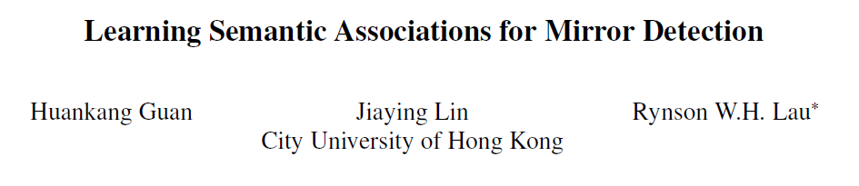
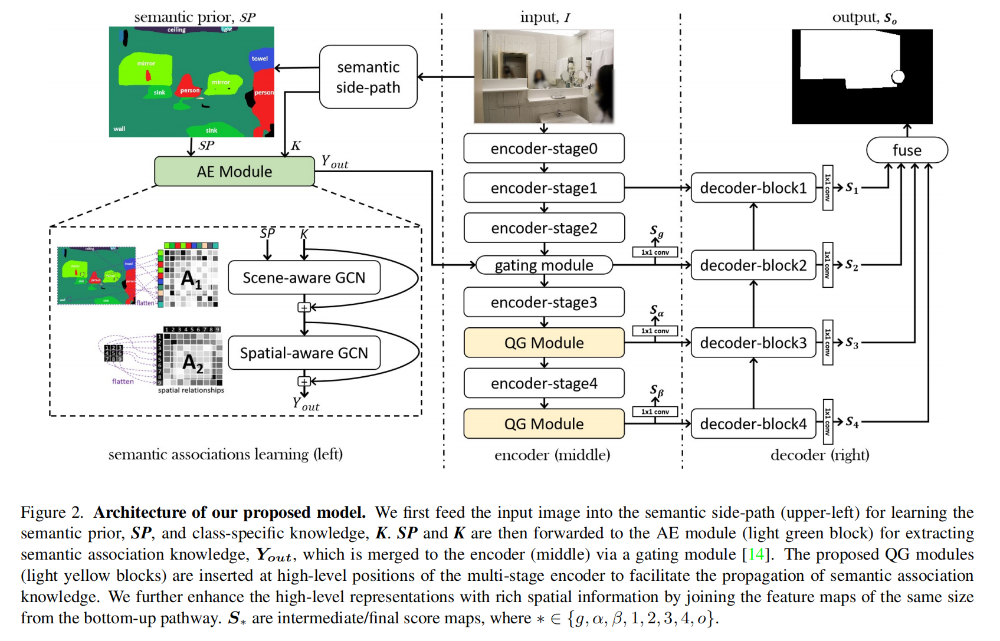
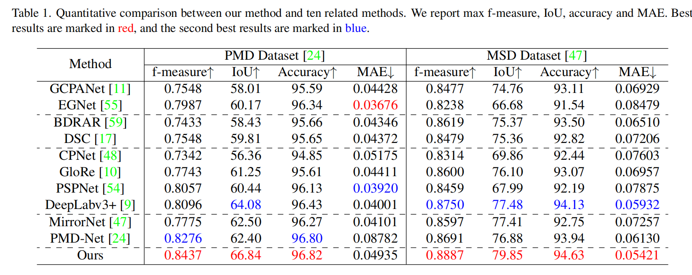
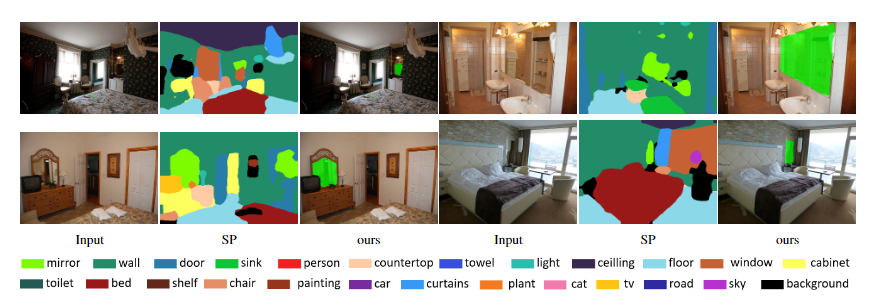

# Paper "Learning Semantic Associations for Mirror Detection" (CVPR 2022)



> [<a href="_readme_doc/CVPR1159_Mirror_detection_supplementary_material_2022.pdf"> suppl</a>] [<a href="https://github.com/guanhuankang/Learning-Semantic-Associations-for-Mirror-Detection"> github</a>]  [<a href="_readme_doc/cvpr22_01159_poster.pdf"> poster</a>]

Mirrors generally lack a consistent visual appearance, making mirror detection very challenging. Although recent
works that are based on exploiting contextual contrasts and corresponding relations have achieved good results, heavily
relying on contextual contrasts and corresponding relations to discover mirrors tend to fail in complex real-world
scenes, where a lot of objects, e.g., doorways, may have similar features as mirrors. We observe that humans tend
to place mirrors in relation to certain objects for specific functional purposes, e.g., a mirror above the sink. Inspired
by this observation, we propose a model to exploit the semantic associations between the mirror and its surrounding
objects for a reliable mirror localization. Our model first acquires class-specific knowledge of the surrounding
objects via a semantic side-path. It then uses two novel modules to exploit semantic associations: 1) an Associations
Exploration (AE) Module to extract the associations of the scene objects based on fully connected graph models,
and 2) a Quadruple-Graph (QG) Module to facilitate the diffusion and aggregation of semantic association knowledge
using graph convolutions. Extensive experiments show that our method outperforms the existing methods and sets
the new state-of-the-art on both PMD dataset (f-measure: 0.844) and MSD dataset (f-measure: 0.889).


## Method Overview



## Quantitative Comparison




## Visual Results




## Installation

This codebase depends on the following packages within python3.7+ env:

> pillow
> numpy
> matplotlib
> pickle
> tqdm
> torch
>
> pydensecrf (for CRF; if you do not use CRF, you can exclude it from your environment)

*tips: 
pydensecrf can be installed from wheel file using pip "pip install wheel_file_name.whl"
Link for downloading pydensecrf whl: https://www.lfd.uci.edu/~gohlke/pythonlibs/#pydensecrf

*where to download checkpoints (inference) and pretrained weights (training):

https://drive.google.com/drive/folders/1URH98GqQas3wyCBVgxLZ3wXhDMxhskC_?usp=sharing


## Quick Start

We provide two scripts (demo.py and visual.py) for inference and visualization purpose. 

```shell
demo.py usage: python demo.py [-h] -c CHECKPOINTS -i IMAGE -o OUTPUT [-nocrf]

visual.py usage: python visual.py [-h] -i IMAGE -m MASK -o OUTPUT
```

We provide some examples for you to play with (examples\input). Just run the demo.bat (Windows OS platform). 

```bash
> demo.bat
```


## Evaluation
we provide a script (evaluation.py) for evaluation (our results: https://drive.google.com/drive/folders/1URH98GqQas3wyCBVgxLZ3wXhDMxhskC_?usp=sharing )

```shell
evaluation.py usage: evaluation.py [-h] -pred PREDICTION -gt MIRRORMASK
```


## How we organize our training/testing data:
PATH_TO_TRAINING_DATA

```shell
├─DATA
│  ├─MSD
│  │  ├─test
│  │  │  ├─image
│  │  │  └─mask
│  │  └─train
│  │      ├─image
│  │      └─mask
│  ├─PMD
│  │  ├─test
│  │  │  └─_ALL
│  │  │      ├─image
│  │  │      └─mask01
│  │  └─train
│  │      ├─image
│  │      └─mask01
│  ├─RGBD-Mirror
│  │  └─RGBD-Mirror
│  │      ├─test
│  │      │  ├─depth
│  │      │  ├─depth_normalized
│  │      │  ├─image
│  │      │  └─mask_single
│  │      └─train
│  │          ├─depth
│  │          ├─depth_normalized
│  │          ├─image
│  │          └─mask_single
│  └─SemSeg
│      ├─ADE20K
│      │  ├─image
│      │  └─seg
│      ├─COCO
│      │  ├─image
│      │  └─seg
│      ├─NYUD-v2
│      │  ├─image
│      │  └─seg
│      └─SUNDataset
│          ├─image
│          └─seg


```


## cite

```raw
@InProceedings{Guan_2022_CVPR,
    author    = {Guan, Huankang and Lin, Jiaying and Lau, Rynson W.H.},
    title     = {Learning Semantic Associations for Mirror Detection},
    booktitle = {Proceedings of the IEEE/CVF Conference on Computer Vision and Pattern Recognition (CVPR)},
    month     = {June},
    year      = {2022},
    pages     = {5941-5950}
}
```

